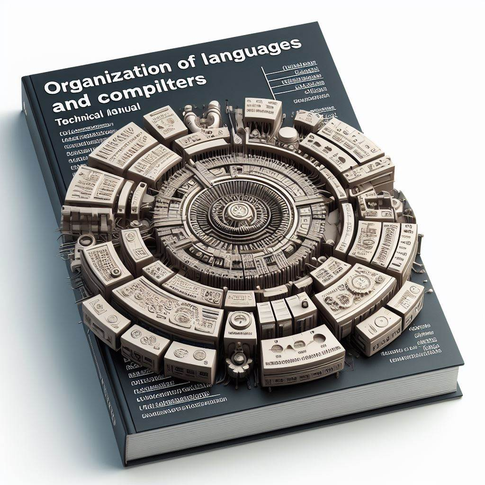

# Manual  Técnico 🖥️
# Organización de Lenguajes y Compiladores 1


# Kevin Estuardo Palacios Quiñonez 
---
# Indice 
1. Introducción 

2. Requerimientos

3. Opciones del Sistema 

4. Manejo del Sistema 

5. Recomendaciones 
---
# 1. Introducción 🤖
---
Este proyecto consiste en el desarrollo de la herramienta denominada Dataforge, este lenguaje combina características de lenguajes de programacion convencionales, con la capacidad de realizar análisis y generación de visualización de los datos de manera eficiente.
# 2. Objetivos ✨
* Desarollar una herramienta de Análisis de Datos.

* Implementar Funciones Estadísticas.

* Generación y visualización de Gráficas.

* Crear una interfaz para el usuario intuitiva.
---
# 3. Dirigido 🤩
### Este manual esta orientado a todos los distintos programadores interesados en el campo de las ciencias de la computación y el funcionamiento de los compiladores así mismo de conocer como funciona el análisis léxico y sintáctico en la lectura de nuevos lenguajes.
---
# 4. Especificación Técnica 😎
### 4.1 Requisitos de Hardware:
* Computadora de Escritorio o Portatil.
* Mínimo 4 Gigas de Memoria RAM.
* 20 GB disponibles de Disco Duro.
* Procesador Core i3 o Superior.
* Procesador a 64 bits.
* Pantalla con Resolución Gráfica de 1024*768 píxeles.
### 4.2 Requisitos de Software:
* Tener Instalado Windows 10 o Superior.
* Java Runtime Enviroment(JRE)versión 8.2 o Superior.
* Java Development Kit (JDK) versión 20.0 o Superior.
* Netbeans IDE 20.0 o Superior.
* Navegador Web
* Librería Java Cup
* Librería Java Flex
* Librería RsyntaxArea
* Librería jfreechart
* Librería Jcommon
* Librería commons-math
---
# 5. Lógica del Programa 👀
### Lenguaje DataForge
Para conocer como esta constituido el lenguaje Dataforge, puede visualizar la parte de Análisis Léxico para poder entender la sintaxis del Lenguaje.
### Análisis Léxico
La siguiente tabla mostrará los siguientes tokens generados en el analizador léxico.
| Token                 | Descripción                  |  Lexema |
|-----------------------|------------------------------|---------|
| PARENTESIS_A          | Cáracter                     | (       | 
| PARENTESIS_C          | Cáracter                     | )       |
| IGUAL                 | Operador                     | =       |
| CORCHETE_ABRE         | Cáracter                     | [       |
| CORCHETE_CIERRA       | Cáracter                     | ]       |
| DOSPUNTOS             | Cáracter                     | :       |
| PUNTOYCOMA            | Cáracter                     | ;       |
| COMA                  | Cáracter                     | ,       |
| GUION                 | Cáracter                     | -       |
| PROGRAM               | Palabra Reservada            | program |
| END                   | Palabra Reservada            | end     |
| VAR                   | Palabra Reservada            | var     |
| R_DOUBLE              | Palabra Reservada            | double  |
| ARR                   | Palabra Reservada            | arr     |
| ARROBA                | Cáracter                     | @       |
| SUM                   | Operador                     | sum     |
| RES                   | Operador                     | res     |
| DIV                   | Operador                     | div     |
| MOD                   | Operador                     | mod     |
| MEDIA                 | Palabra Reservada            | media   |
| MEDIANA               | Palabra Reservada            | mediana |
| MODA                  | Palabra Reservada            | moda    |
| VARIANZA              | Palabra Reservada            | varianza|
| MAX                   | Palabra Reservada            | max     |
| MIN                   | Palabra Reservada            | min     |    
| PRINT                 | Palabra Reservada            | print   |
| COLUMN                | Palabra Reservada            | column  | 
| CONSOLE               | Palabra Reservada            | console |
| EXEC                  | Palabra Reservada            | exec    | 
| TITULO                | Palabra Reservada            | titulo  |
| VALUES                | Palabra Reservada            | values  | 
| LABEL                 | Palabra Reservada            | label   |
| EJEX                  | Palabra Reservada            | ejex    | 
| EJEY                  | Palabra Reservada            | ejey    |
| TITULOX               | Palabra Reservada            | titulox | 
| TITULOY               | Palabra Reservada            | tituloy | 
| GRAPHPIE              | Palabra Reservada            | graphpie| 
| GRAPHBAR              | Palabra Reservada            | graphbar|
| GRAPHLINE             | Palabra Reservada            |graphline| 
| HISTOGRAM             | Palabra Reservada            |histogram|
| POR                   | Operador                     |  *      | 
| MAS                   | Operador                     |+        |
| MENOS                 | Operador                     |  -      | 
| MENORQUE              | Cáracter                     |<        |
| MAYORQUE              | Cáracter                     |>        |
| R_MOSTRAR             | Cáracter                     |mostrar  |

La siguiente tabla mostrará las expresiones regulares utilizadas para obtener más tokens aceptados en el lenguaje Dataforge.

| Token                 | Expresión Regular                   | Ejemplo |
|-----------------------|-------------------------------------|----------------------------------|
| entero                | [0-9]+                              | 9       | 
| cadena                | [\"][^\"\n]*[\"]                    |"cadena" |
| identificador         | [a-zA-Z][a-zA-Z0-9_]*               | id      | 
| decimal               | \d+\.\d+                            | 9.0     |
|comentariosimple       | \![^\n]*                            |! Simple| 
| multilinea            | [<][!][^!]*[!]+([^>*][^!]*[*]+)*[>] | <! Esto es un comentario
Multilínea !>      |

### Generadores/Analizadores Jflex/Cup
Este método se encarga de generar 2 analizadores mediante las librerías de flex y cup, tambien los analizadores se encargan de verificar que la sintaxis de los archivos enviados sea correcta, en caso contrario genera errores.

```java
public static void main(String[] args) {  
    analizadores("src/DataForge_/", "Lexer.jflex", "Parser.cup"); 
    Window pantallita = new Window ();
    pantallita.setVisible(true);
}

public static void analizadores(String ruta, String jflexFile, String cupFile){
    try {
        String opcionesJflex[] =  {ruta+jflexFile,"-d",ruta};
        jflex.Main.generate(opcionesJflex);

        String opcionesCup[] =  {"-destdir", ruta,"-parser","Parser",ruta+cupFile};
        java_cup.Main.main(opcionesCup);
            
    } catch (Exception e) {
        System.out.println("No se ha podido generar los analizadores");
        System.out.println(e);
    }
}
```

### Realizar Análisis
Esta función se encarga de realizar el análisis mediante el uso de las herramientas Jflex y Cup.
```java
    public static void analizar (String entrada){
        try {
            DataForge_.Lexer lexer = new DataForge_.Lexer(new StringReader(entrada)); 
            DataForge_.Parser parser = new DataForge_.Parser(lexer);
            parser.parse();
        } catch (Exception e) {
            System.out.println("Error fatal en compilación de entrada.");
            System.out.println(e);
        }
```
### Función AbrirArchivo
```java
    private void AbrirArchivoActionPerformed(java.awt.event.ActionEvent evt) {                                             
    JFileChooser fc = new JFileChooser();

    // Se crea el filtro de extensiones de documento
    FileNameExtensionFilter filtro = new FileNameExtensionFilter("Archivo DF (*.df)", "df");
    // Se indica el uso del filtro
    fc.setFileFilter(filtro);

    // Verificar si hay contenido en la pestaña actual antes de abrir un nuevo archivo
    if (Pestana.getSelectedIndex() != -1) {
        JPanel panel = (JPanel) Pestana.getSelectedComponent();
        RSyntaxTextArea textArea = (RSyntaxTextArea) ((RTextScrollPane) panel.getComponent(0)).getViewport().getView();
        String contenidoActual = textArea.getText();

        // Si hay contenido en la pestaña actual, preguntar al usuario si desea guardar antes de abrir otro archivo
        if (!contenidoActual.isEmpty()) {
            int opcion = JOptionPane.showConfirmDialog(this, "¿Desea guardar el archivo actual antes de abrir uno nuevo?", "Guardar archivo", JOptionPane.YES_NO_CANCEL_OPTION);
            if (opcion == JOptionPane.YES_OPTION) {
                // Llamar a la función para guardar el archivo actual
                
                GuardarActionPerformed(null);
            } else if (opcion == JOptionPane.CANCEL_OPTION) {
                // Si el usuario elige cancelar, salir de la función sin abrir un nuevo archivo
                return;
            }
        }
    }

    // Se abre ventana y se cargan 
    int seleccion = fc.showOpenDialog(this);
    // Si el usuario presiona aceptar
    if (seleccion == JFileChooser.APPROVE_OPTION) {
        File fichero = fc.getSelectedFile();
        archivoAbierto = fichero; // Actualiza el archivo abierto

        // Obtenemos el nombre del archivo seleccionado
        String nombreArchivo = fichero.getName();

        try (FileReader fr = new FileReader(fichero)) {
            String cadena = "";
            int valor = fr.read();
            while (valor != -1) {
                cadena = cadena + (char) valor;
                valor = fr.read();
            }

            // Obtener el panel de la pestaña seleccionada
            JPanel panel = (JPanel) Pestana.getSelectedComponent();
            // Obtener el RSyntaxTextArea del panel
            RSyntaxTextArea textArea = (RSyntaxTextArea) ((RTextScrollPane) panel.getComponent(0)).getViewport().getView();
            // Establecer el texto en el RSyntaxTextArea
            textArea.setText(cadena);

            // Establecer el nombre de la pestaña como el nombre del archivo
            Pestana.setTitleAt(Pestana.getSelectedIndex(), nombreArchivo);

        } catch (IOException el) {
            el.printStackTrace();
        }
    }
 
    } 
```
### Funicón Guardar
Este manejador de eventos guarda el contenido de un RSyntaxTextArea en un archivo si hay un archivo abierto, y muestra mensajes de diálogo apropiados dependiendo del resultado de la operación de guardado.
```java

```
### Función Recepción
Esta función toma una lista de valores y los concatena en una cadena formateada, separando cada valor por comas y agregando un salto de línea al final.
```java

    public static String recepcion(LinkedList<Object> valores) {
        StringBuilder recibir = new StringBuilder("! Salida: ");
        int size = valores.size();
        for (int i = 0; i < size; i++) {
            recibir.append(valores.get(i));
            if (i < size - 1) { // Agregar coma y espacio si no es el último elemento
                recibir.append(", ");
            }
        }
        recibir.append("\n");
        return recibir.toString();
    }
```
### Función GuardarComo
Este manejador de eventos permite al usuario seleccionar una ubicación y un nombre para guardar un archivo con una extensión específica (.df) y muestra un mensaje de confirmación después de guardar el archivo correctamente.
```java
    private void GuardarComoActionPerformed(java.awt.event.ActionEvent evt) {                                            
    JFileChooser guardarArchivo = new JFileChooser();
    guardarArchivo.setDialogTitle("Guardar Como");

    // Agrega los filtros para las extensiones
    FileNameExtensionFilter filtroSP = new FileNameExtensionFilter("Archivo DF (*.df)", "df");
    guardarArchivo.addChoosableFileFilter(filtroSP);

    int opcion = guardarArchivo.showSaveDialog(this);
    File archivo;

    if (opcion == JFileChooser.APPROVE_OPTION) {
        String nombre = guardarArchivo.getSelectedFile().getName();
        String ruta = guardarArchivo.getSelectedFile().getAbsolutePath();
        
        // Obtener el filtro seleccionado
        FileFilter filtroSeleccionado = guardarArchivo.getFileFilter();
        
        // Obtener la extensión del filtro seleccionado
        String extension = "df";
        if (filtroSeleccionado instanceof FileNameExtensionFilter) {
            FileNameExtensionFilter filtroExtension = (FileNameExtensionFilter) filtroSeleccionado;
            extension = filtroExtension.getExtensions()[0];
        }
        
        archivo = new File(ruta + "." + extension);

        try {
            if (!archivo.exists()) {
                archivo.createNewFile();
            }

            // Obtener el panel de la pestaña seleccionada
            JPanel panel = (JPanel) Pestana.getSelectedComponent();
            // Obtener el RSyntaxTextArea del panel
            RSyntaxTextArea textArea = (RSyntaxTextArea) ((RTextScrollPane) panel.getComponent(0)).getViewport().getView();
            
            // Obtener el nombre de la pestaña actual
            String nombrePestana = Pestana.getTitleAt(Pestana.getSelectedIndex());

            FileWriter fw = new FileWriter(archivo);
            BufferedWriter bw = new BufferedWriter(fw);
            bw.write(textArea.getText());
            bw.close();
            
            // Cambiar el nombre de la pestaña actual al nombre del archivo
            Pestana.setTitleAt(Pestana.getSelectedIndex(), nombre);
            
            JOptionPane.showMessageDialog(this, "Se guardó el archivo correctamente");
        } catch (IOException ex) {
            // Manejo de excepciones
        }
    

    }
```
### Función addNewTab
Este método se encarga de crear nuevas pestañas con sus respectivas TextArea, se encarga de validar de la existencia de anteriores pestañas y sobre que text area se encuentra el usuario.
 ```java
 private void addNewTab() {
    JPanel panel = new JPanel(new BorderLayout()); // Creamos un panel con un layout BorderLayout
    panel.setBackground(Color.WHITE);

    RSyntaxTextArea textArea = new RSyntaxTextArea(); // Creamos el RSyntaxTextArea
    RTextScrollPane sp = new RTextScrollPane(textArea); // Envolvemos el RSyntaxTextArea en un RTextScrollPane

    textArea.setFont(new Font("Monospaced", Font.PLAIN, 18));
    textArea.setSyntaxEditingStyle(SyntaxConstants.SYNTAX_STYLE_PYTHON); // Establecemos el estilo de sintaxis

    panel.add(sp, BorderLayout.CENTER); // Agregamos el RTextScrollPane al centro del panel

    Pestana.addTab("Pestaña " + tabCounter, panel); // Agregamos el panel a la pestaña
    Pestana.setSelectedIndex(tabCounter - 1); // Establecemos la nueva pestaña como la pestaña actual
    tabCounter++;
}
 ```
### Funcion TabladatosObject
Este método se encarga de recibir datos, identificadores y valores, los procesa de alguna manera, los almacena en un objeto sim, lo agrega a una lista de símbolos.
 ```java
    public static void TablaDatosObject(String dato, String id, Object[] valores,int linea, int columna){
        funciones.simbolos sim = new funciones.simbolos();
        sim.recibir_datos(dato, id, valores, linea, columna);
        ListaSimbolos.add(sim);    
        for (int i = 0; i < valores.length; i++) {
            System.out.println(valores[i]);
        }
    }
```
### Funcion busqueda
Este método busca un identificador en una lista de símbolos y devuelve el valor asociado a ese identificador. Si no lo encuentra, devuelve null.
```java
    public static Object busqueda(String id){
        //funciones.simbolos ob =objeto
        funciones.simbolos objeto = new funciones.simbolos();
        
        for (int i =0;i<ListaSimbolos.size();i++ ){
        objeto =(simbolos) ListaSimbolos.get(i);
        if(objeto.getId().equals(id)){
            System.out.println(objeto.getValor());
            return objeto.getValor();
            
        }
        }return null;
        
    }
```    
### Funcion tokens_DF
Este método genera un informe de tokens en formato HTML para el analizador léxico de DataForge y lo guarda en un archivo.
```java   
    public static void tokens_DF() {
        // Generar el código HTML
        StringBuilder constructort = new StringBuilder();
        constructort.append("<html lang=\"en\">");
        constructort.append("<head>");
        constructort.append("<meta charset=\"utf-8\">");
        constructort.append("<meta name=\"viewport\" content=\"width=device-width, initial-scale=1\">");
        constructort.append("<link href=\"https://cdn.jsdelivr.net/npm/bootstrap@5.1.3/dist/css/bootstrap.min.css\" rel=\"stylesheet\" integrity=\"sha384-1BmE4kWBq78iYhFldvKuhfTAU6auU8tT94WrHftjDbrCEXSU1oBoqyl2QvZ6jIW3\" crossorigin=\"anonymous\">");
        constructort.append("<link rel=\"shortcut icon\" href=\"Icono.ico\">");
        constructort.append("<title>Reporte de Tokens DataForge</title>");
        constructort.append("</head>");
        constructort.append("<body>");
        constructort.append("<div class=\"p-3 mb-2 text-white\" style=\"background-color:#63e526\">");
        constructort.append("<h1><center>Reporte de Tokens DataForge</center></h1>");
        constructort.append("</div>");
        constructort.append("<table class=\"table table-dark table-hover table-bordered\">");
        constructort.append("<thead>");
        constructort.append("<tr>");
        constructort.append("<th scope=\"col\">#</th>");
        constructort.append("<th scope=\"col\">Lexema</th>");
        constructort.append("<th scope=\"col\">Token</th>");
        constructort.append("<th scope=\"col\">Línea</th>");
        constructort.append("<th scope=\"col\">Columna</th>");
        constructort.append("</tr>");
        constructort.append("</thead>");
        constructort.append("<tbody>");
        int contadort = 1;
        for (Object tokensS : ListaTokensDF) {
            funciones.tokensdataforge dato = (funciones.tokensdataforge) tokensS;
            constructort.append("<tr class=\"table-success\">");
            constructort.append("<td>").append(contadort).append("</td>");
            constructort.append("<td>").append(dato.getLexema()).append("</td>");
            constructort.append("<td>").append(dato.getToken()).append("</td>");
            constructort.append("<td>").append(dato.getLinea()).append("</td>");
            constructort.append("<td>").append(dato.getColumna()).append("</td>");
            constructort.append("</tr>");
            contadort++;
        }

        constructort.append("</tbody>");
        constructort.append("</table>");
        constructort.append("</body>");
        constructort.append("</html>");

        // Escribir el código HTML en un archivo
        try {
            FileWriter tokensS = new FileWriter("ReporteTokens_DataForge.html");
            tokensS.write(constructort.toString());
            tokensS.close();
        } catch (IOException e) {
            e.printStackTrace();

        }
        ListaTokensDF.clear();

    }
```   
### Funcion Analizar
Este manejador de evento realiza un análisis del texto de la pestaña seleccionada y ejecuta varias funciones relacionadas con la generación de informes o resultados. Luego, concatena estos resultados en una cadena y los muestra en un componente de interfaz gráfica.
 ```java
    private void jMenuItem3ActionPerformed(java.awt.event.ActionEvent evt) {                                           
    // Obtener el texto del área de texto de la pestaña seleccionada
    String textoPestanaSeleccionada = obtenerTextoPestanaSeleccionada();
    
    // Llamar a la función analizar con el texto de la pestaña seleccionada
    System.out.println("Analizando...");
    analizar(textoPestanaSeleccionada);
    funciones.reportes.tokens_DF();
    funciones.reportes.errores_DF();
    funciones.reportes.tabla_simbolos();
        String jump="";
        for (int i = 0; i < funciones.saltos.lista_general.size(); i++) {
            jump+=funciones.saltos.lista_general.get(i);
        }Salida.setText(jump);
    } 
```
### Función Salto de Línea 
Esta función formatea una lista de objetos con un título y una línea divisoria antes y después del título, y cada elemento de la lista se presenta en una línea separada. Es útil para imprimir listas de objetos de manera ordenada y legible.
```java
    public static String lista_salto_de_linea(Object[] lista, String nombretitulo){
        StringBuilder t = new StringBuilder("------------\n");
        t.append(nombretitulo);
        t.append("\n------------\n");
        contador++; // Incrementar contador
        for (int i = 0; i < lista.length; i++) {
            t.append(lista[i].toString()+"\n");
        }
        return t.toString();
    }
```    
### Función Linea
Esta función genera un gráfico de línea a partir de los datos proporcionados y guarda el gráfico como una imagen JPEG en el sistema de archivos.
```java
   public String linea(
            String titulo,
            String Titulo,
            String TituloX,
            String TituloY,
            double valores[],
            String ejex[]
    ) throws IOException {
        DefaultCategoryDataset dataset = new DefaultCategoryDataset();

        for (int i = 0; i < valores.length; i++) {
            dataset.addValue(valores[i], "Valor", ejex[i]);
        }

        JFreeChart grafica = ChartFactory.createLineChart(
                titulo,
                TituloX,
                TituloY,
                dataset);

        String filename = "grafico_linea.jpg";
        ChartUtilities.saveChartAsJPEG(new File(filename), grafica, 500, 300);
        return filename;
    }
```
### Función HtmlImagen
Esta función genera un archivo HTML que muestra una página web con todas las imágenes especificadas en la lista de rutas de archivos de imágenes. Cada imagen se muestra centrada en la página y separada por un margen inferior.
```java
    public static void HtmlImagen(List<String> imageFiles, String outputFile) throws IOException {
        try (BufferedWriter writer = new BufferedWriter(new FileWriter(outputFile))) {
            writer.write("<!DOCTYPE html>");
            writer.write("<html>");
            writer.write("<head>");
            writer.write("<title>Gráficos Generados</title>");
            writer.write("<style>");
            writer.write("img {");
            writer.write("display: block;");
            writer.write("margin-left: auto;");
            writer.write("margin-right: auto;");
            writer.write("margin-bottom: 20px;"); // Añadir margen entre las imágenes
            writer.write("}");
            writer.write("</style>");
            writer.write("</head>");
            writer.write("<body style='background-color: #ADD8E6;'>"); // Fondo celeste

            for (String imageFile : imageFiles) {
                writer.write("<br>");
            }

            writer.write("</body>");
            writer.write("</html>");
        }
    }
```
### Función media
 Este método toma un arreglo de números, suma todos los elementos y luego divide esa suma por el número de elementos para obtener la media, que luego se devuelve.
```java
  public static double media(double[] arreglo) {


        double suma = 0;

        // Calcular la suma de todos los elementos en el arreglo
        for (double valor : arreglo) {
            suma += valor;
        }

        // Calcular la media dividiendo la suma por el número de elementos
        double media = suma / arreglo.length;

        return media;
    } "
```
### Función Mediana
Este método ordena el arreglo, luego determina si la cantidad de elementos en el arreglo es par o impar, y calcula la mediana en consecuencia. Si es par, devuelve el promedio de los dos valores centrales; si es impar, devuelve el valor central.
```java
    public static double Mediana(double[] arreglo) {


        // Ordenar el arreglo
        Arrays.sort(arreglo);

        int n = arreglo.length;
        if (n % 2 == 0) {
            // Si hay una cantidad par de elementos, calcular la media de los dos valores centrales
            return (arreglo[n / 2 - 1] + arreglo[n / 2]) / 2.0;
        } else {
            // Si hay una cantidad impar de elementos, devolver el valor central
            return arreglo[n / 2];
        }
    }    
```
### Función Moda
Este método recorre el arreglo para encontrar la moda, que es el elemento que aparece con mayor frecuencia en el conjunto de datos.
```java
    public static double Moda(double[] arreglo) {
 

        // Ordenar el arreglo para facilitar la búsqueda de la moda
        Arrays.sort(arreglo);

        double moda = arreglo[0]; // Primer Elemento es moda
        int maxFrecuencia = 1; // Frecuencia máxima encontrada hasta ahora
        int frecuenciaActual = 1; // Frecuencia del elemento actual
        double elementoActual = arreglo[0]; // Elemento actual

        // Iterar sobre el arreglo para encontrar la moda
        for (int i = 1; i < arreglo.length; i++) {
            if (arreglo[i] == elementoActual) {
                frecuenciaActual++;
            } else {
                if (frecuenciaActual > maxFrecuencia) {
                    maxFrecuencia = frecuenciaActual;
                    moda = elementoActual;
                }
                frecuenciaActual = 1;
                elementoActual = arreglo[i];
            }
        }

        // Comprobar el último grupo de elementos
        if (frecuenciaActual > maxFrecuencia) {
            moda = elementoActual;
        }

        return moda;
    }
```
### Función Varianza
Este método calcula la varianza de un conjunto de datos utilizando la fórmula estándar de varianza, que implica calcular la diferencia entre cada valor y la media, elevar al cuadrado esas diferencias, sumarlas y dividir el resultado entre el número total de elementos.
```java
    public static double Varianza(double[] arreglo) {


        double media = media(arreglo);
        double sumaCuadradosDiferencias = 0;

        // Calcular la suma de los cuadrados de las diferencias entre cada valor y la media
        for (double valor : arreglo) {
            sumaCuadradosDiferencias += Math.pow(valor - media, 2);
        }

        // Calcular la varianza dividiendo la suma de los cuadrados de las diferencias entre el número de elementos
        double varianza = sumaCuadradosDiferencias / arreglo.length;

        return varianza;
    }    
```
### Función Maximo
Este método busca el valor máximo en un arreglo recorriendo todos los elementos y actualizando continuamente el valor máximo encontrado hasta el momento.
```java
    public static double Maximo(double[] arreglo) {


        double maximo = arreglo[0]; // Suponemos que el primer elemento es el máximo inicialmente

        // Iteramos sobre el arreglo para encontrar el máximo
        for (int i = 1; i < arreglo.length; i++) {
            if (arreglo[i] > maximo) {
                maximo = arreglo[i];
            }
        }

        return maximo;
    }
```    
### Función Minimo
Este método busca el valor mínimo en un arreglo recorriendo todos los elementos y actualizando continuamente el valor mínimo encontrado hasta el momento.
```java    
    public static double Minimo(double[] arreglo) {


        double minimo = arreglo[0]; // Suponemos que el primer elemento es el máximo inicialmente

        // Iteramos sobre el arreglo para encontrar el máximo
        for (int i = 1; i < arreglo.length; i++) {
            if (arreglo[i] < minimo) {
                minimo = arreglo[i];
            }
        }

        return minimo;
    }
```    
### Calcular Frecuencias
Estos métodos juntos calculan las frecuencias de los valores en un arreglo, generan una tabla con los resultados y cuentan las repeticiones de valores específicos en el arreglo.
```java   
    public static  void calcularFrecuenciass(double[] valores) {
        StringBuilder resultado = new StringBuilder();

        // Ordenamos los valores para facilitar el cálculo
        Arrays.sort(valores);

        // Creamos un array para almacenar los valores únicos y su frecuencia
        double[] valoresUnicos = new double[valores.length];
        int indiceUnico = 0;

        // Calculamos las frecuencias para cada valor único
        double valorActual = valores[0];
        int frecuencia = 1;
        for (int i = 1; i < valores.length; i++) {
            if (valores[i] == valorActual) {
                frecuencia++;
            } else {
                valoresUnicos[indiceUnico] = valorActual;
                indiceUnico++;
                valorActual = valores[i];
                frecuencia = 1;
            }
        }
        // Agregamos el último valor único
        valoresUnicos[indiceUnico] = valorActual;

        // Calculamos la cantidad total de valores únicos
        int totalValoresUnicos = indiceUnico + 1;

        // Creamos arrays para almacenar las frecuencias brutas y acumuladas
        int[] fb = new int[totalValoresUnicos];
        int[] fa = new int[totalValoresUnicos];
        double[] fr = new double[totalValoresUnicos];

        // Calculamos las frecuencias brutas y acumuladas, y las frecuencias relativas acumuladas
        int frecuenciaAcumulada = 0;
        double sumaFr = 0;
        for (int i = 0; i < totalValoresUnicos; i++) {
            fb[i] = contarRepeticioness(valores, valoresUnicos[i]);
            frecuenciaAcumulada += fb[i];
            fa[i] = frecuenciaAcumulada;
            fr[i] = (double) Math.round(((double) fb[i] / valores.length) * 100);
            sumaFr += fr[i];
        }

        // Construimos la tabla con los datos
        resultado.append("_____________________________\n");
        resultado.append("Valor\tFb\tFa\tFr\n");
        resultado.append("_____________________________\n");

        for (int i = 0; i < totalValoresUnicos; i++) {
            resultado.append(valoresUnicos[i]).append("\t").append(fb[i]).append("\t").append(fa[i]).append("\t").append(fr[i]).append("%\n");
        }

        // Agregamos la línea divisoria inferior y los totales
        resultado.append("_____________________________\n");
        resultado.append("Totales: ").append(Arrays.stream(fb).sum()).append("\t").append(Arrays.stream(fa).sum()).append("\t").append(sumaFr).append("%\n");
        resultado.append("_____________________________\n");
        funciones.saltos.lista_general.add(resultado.toString());
        
    }

    public static int contarRepeticioness(double[] array, double valor) {
        int contador = 0;
        for (double elemento : array) {
            if (elemento == valor) {
                contador++;
            }
        }
        return contador;
    }
```       
### Función abrirArchivoHTML
Esta función proporciona una manera conveniente de abrir un archivo HTML en el navegador web predeterminado del sistema.
```java
    public static void abrirArchivoHTML(String rutaHTML) {
        File archivoHTML = new File(rutaHTML);

        if (archivoHTML.exists()) {
            try {
                Desktop.getDesktop().browse(archivoHTML.toURI());
            } catch (IOException e) {
                e.printStackTrace();
            }
        } else {
            System.out.println("El archivo HTML no existe.");
        }
    }
```
---
# 6. Créditos
Elaborado por el estudiante Kevin Estuardo Palacios para el curso de Organización de Lenguajes y Compiladores 1, en el país de Guatemala, entregado el día Domingo 10 de Marzo de 2024.

[Enlace a mi repositorio en GitHub](https://github.com/KevinPalaciosQ/OLC1_Proyecto1_201902278.git)