# Manual de Usuario ☝️🤓
# Organización de Lenguajes y Compiladores 1

# Kevin Estuardo Palacios Quiñonez 
# 201902278
---
# Indice 

1. Introducción 

2. Requerimientos 

3. Opciones del Sistema 

4. Manejo del Sistema 

5. Recomendaciones 

6. Créditos

---
# 1. Introducción 🤖
###  1.1 Objetivo
Otorgar al usuario un apoyo documentado del uso de la interfaz gráfica al igual que el manejo del pseudocódigo y poder obtener los datos de manera exitosa de su entrada de texto, sin errores y con éxito en el uso de la herramienta.
---
# 2. Requerimientos ✨
* Computadora de Escritorio o Portatil.
* Mínimo 4GB de Memoria RAM.
* 20 GB disponibles de Disco Duro.
* Procesador Core i3 o Superior.
* Procesador a 64 bits.
* Netbeans IDE 20.0 o Superior.
* Java Development Kit (JDK) versión 20.0 o Superior.
* Pantalla con Resolución Gráfica de 1024*768 píxeles.
---
# 3. Opciones del Sistema 🤩
---
1. Archivo
* Nuevo Archivo: Se crea un archivo con extensión .df.
* Abrir Archivo: Se abre un archivo con extensión .df.
* Guardar: Guarda un Archivo que ha sido abierto.
* Guardar Como: permite al usuario seleccionar la ubicación y el nombre del archivo que desea guardar, lo que le brinda más flexibilidad y control sobre la operación de guardado en comparación con la opción de "Guardar".
2. Pestañas
* Nueva Pestaña: Crea nuevas pestañas.
* Eliminar Pestaña: Elimina la pestaña en la cual se encuentra el usuario.
3. Ejecutar
* Iniciar depuración: Se encarga de Realizar el Análisis léxico y sintáctico con las herramientas jflex y cup.
4. Reporte
* Reporte de Tokens: Abre el reporte de tokens.
* Reporte de errores Léxicos: Abre el reporte de errores léxicos.
* Tabla de Símbolos: abre el reporte de tabla de símbolos.

# 4. Manejo del Sistema 😎
---
## 4.1 Al iniciar el programa ir hacia archivo
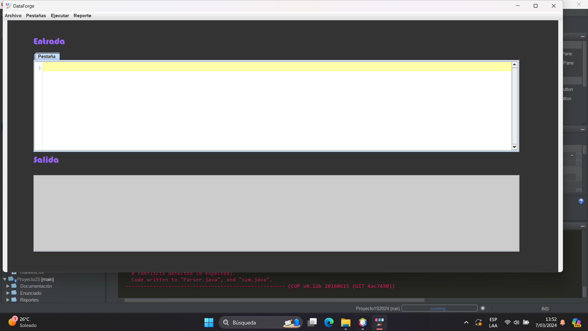
## 4.2 Elegir la opción Abrir archivo
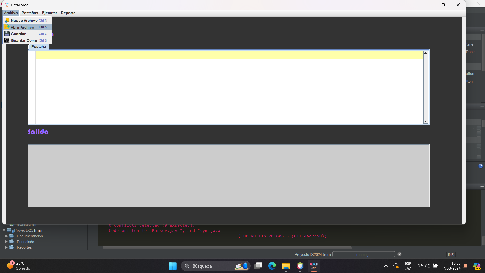
## 4.3 Seleccionar un archivo con extensión.df 
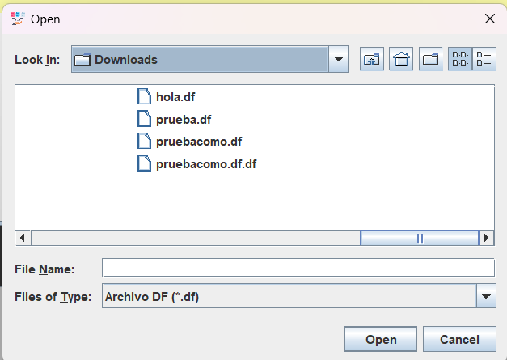
## 4.4 Luego de seleccionar un archivo ir a Ejecutar e iniciar depuración
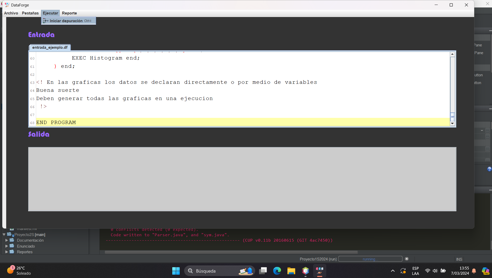
## 4.5 Al seleccionarlo se mostrará la salida del compilador
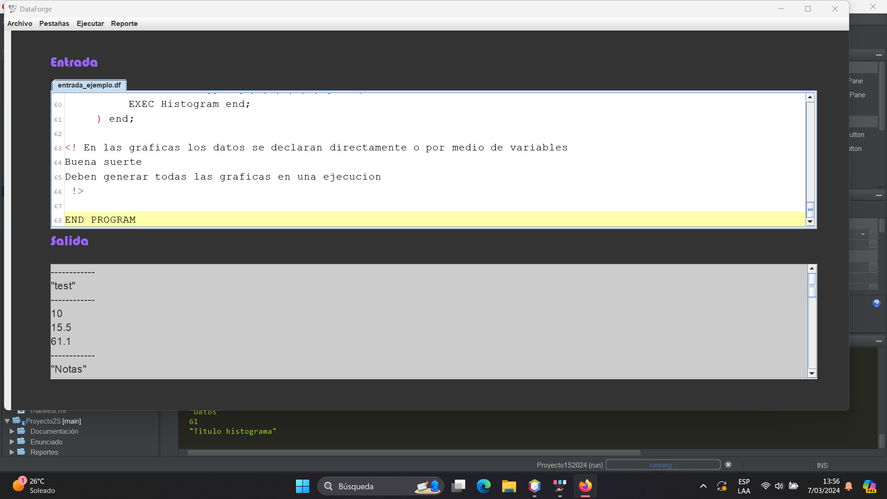
## 4.5 Se mostrará el reporte de gráficas luego de iniciar la depuración 
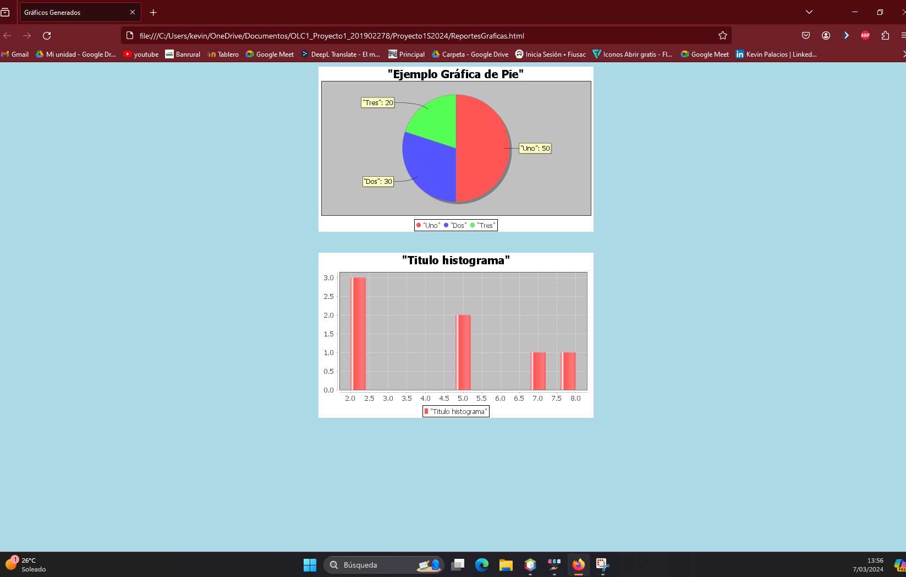
## 4.6 Para las opciones de reportes podrás elegir cualquiera de los 3
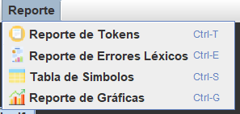
## 4.7 Elegir Reporte de Tokens
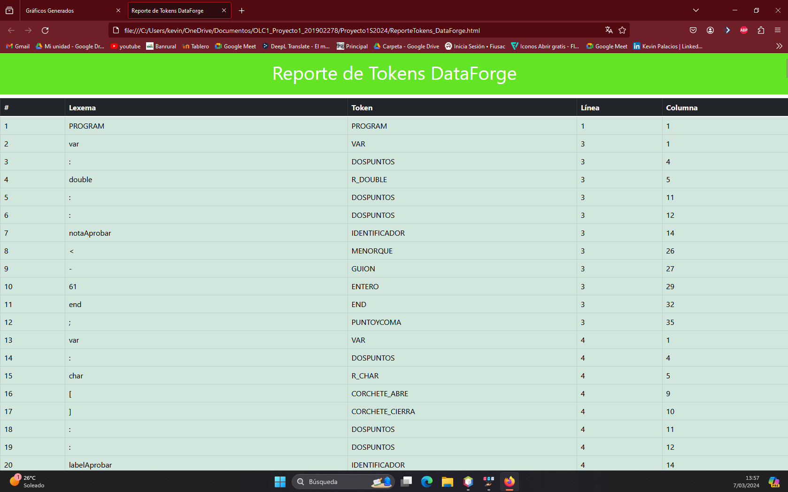
## 4.8 Elegir Reporte de Errores Léxicos
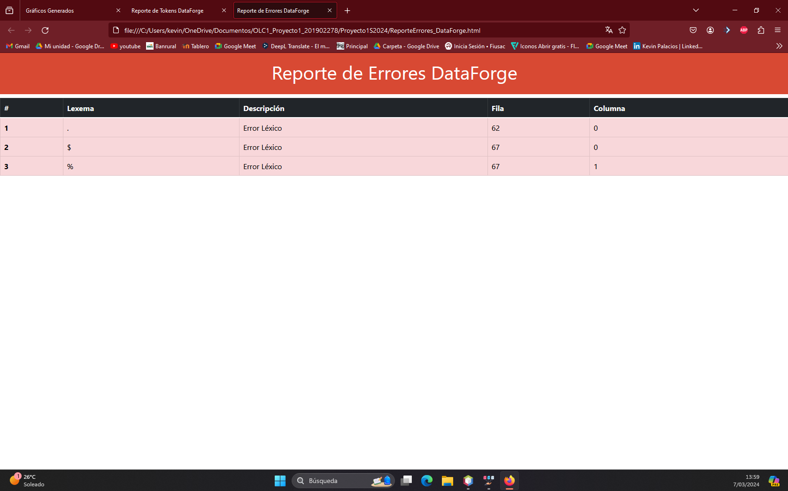
## 4.9 Tabla de Simbolos
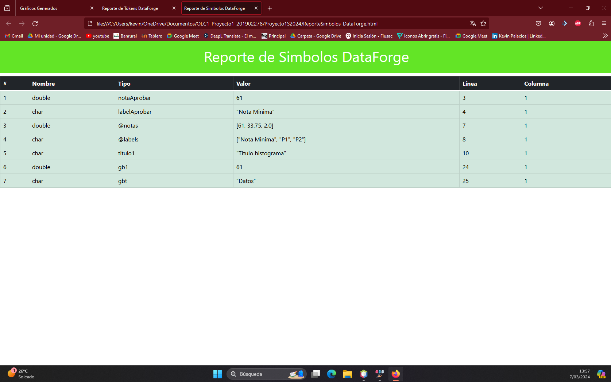
## 4.10 Pestañas
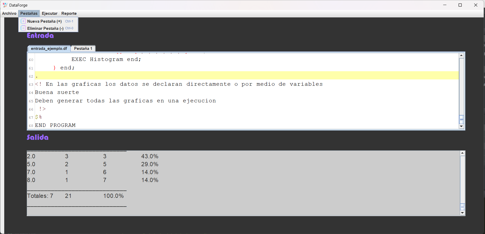
## 4.11 Opciones de Archivos
* Nuevo Archivo: se genera un nuevo archivo.
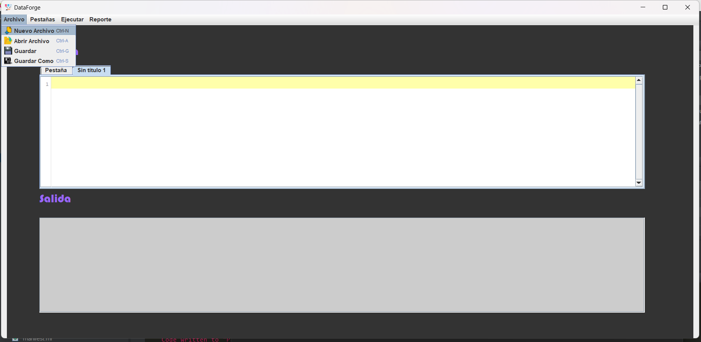
* Guardar
Al elegir esta opción el archivo abierto se sobreescribirá.
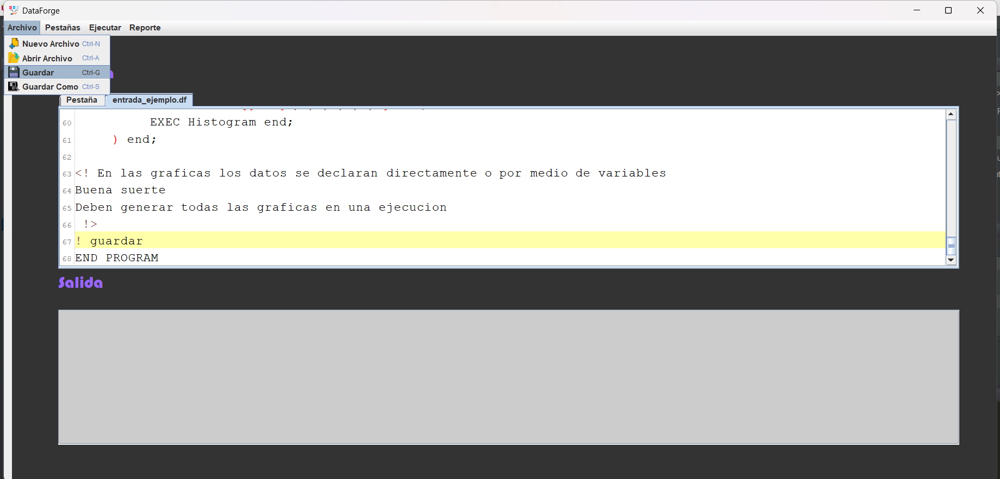
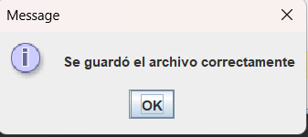
---
* Guardar Como
---
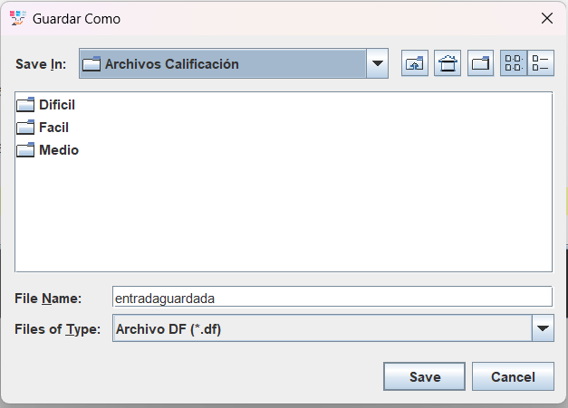

# 5. Recomendaciones 👀
* Debe usar unicamente archivos con la extensión. df para poder ejecutar el archivo
* Siga las instrucciones al pie de la letra.
---
# 6. Créditos 🧐
Elaborado por el estudiante Kevin Estuardo Palacios para el curso de Organización de Lenguajes y Compiladores 1, en el país de Guatemala, entregado el día Domingo 10 de Marzo de 2024.

[Enlace a mi repositorio en GitHub](https://github.com/KevinPalaciosQ/OLC1_Proyecto1_201902278.git)